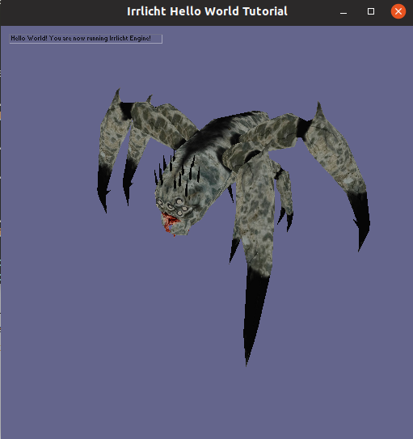

# irrlicht-hello-world

Hello world using irrlicht library.
Tested on Ubuntu 19.10

# Dep

	sudo apt install libirrlicht-dev

# Running

	make run

# Ref

* [freebeast.zip](https://www.psionicgames.com/downloads/freebeast.zip)

* http://irrlicht.sourceforge.net